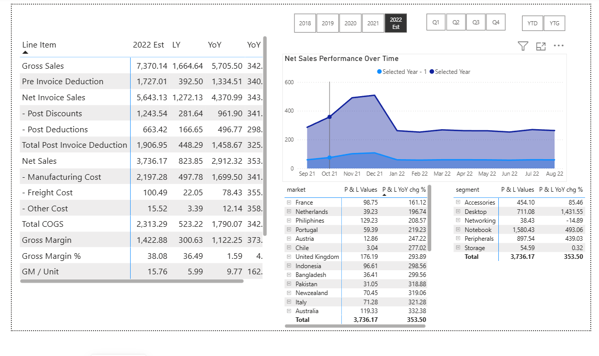
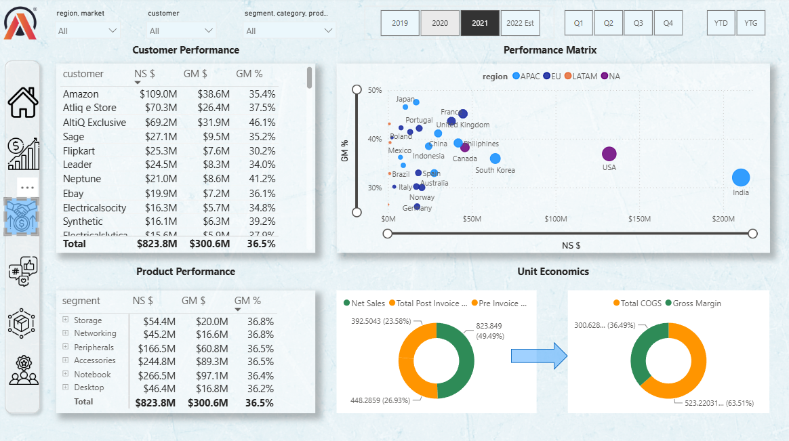
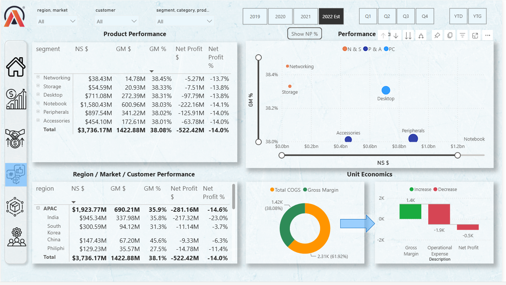
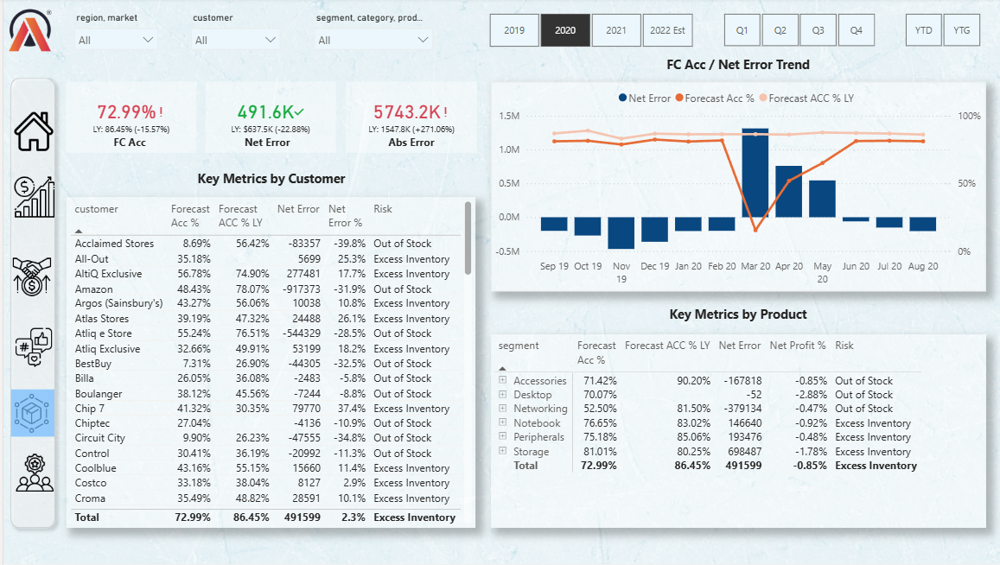
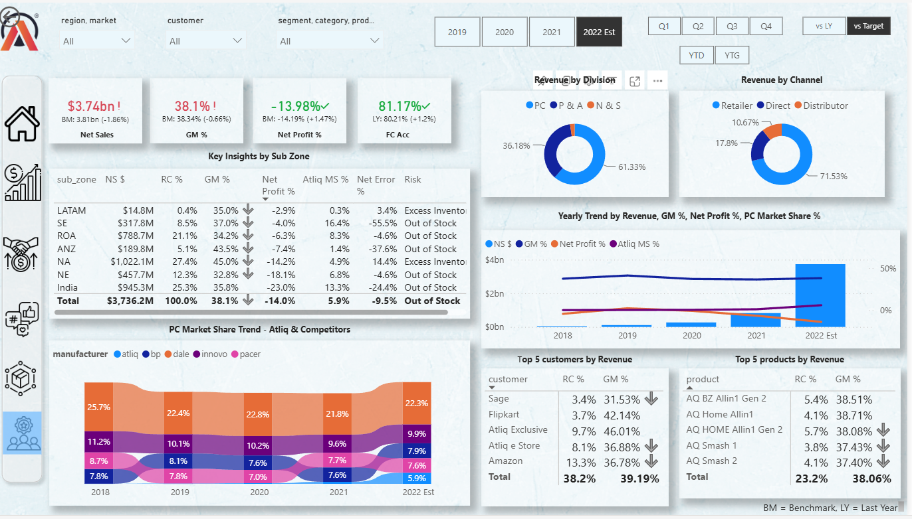

# Business Insights 360 

## Project Overview
A detailed analysis of business data using Power BI, including finance, sales, marketing, and supply chain analysis, to support data-driven decision-making. The solution consists of five interactive dashboards that provide a 360-degree view of business performance, enabling stakeholders to monitor KPIs, identify trends, and make data-driven decisions. It includes an executive view dashboard for overall performance analysis tailored to decision-makers. 

Live Dashboard
https://app.powerbi.com/view?r=eyJrIjoiYTZlNTQ0NDgtMmM0Zi00ZDYxLTk1NTktMTMxODcyZWM2Y2M0IiwidCI6ImM2ZTU0OWIzLTVmNDUtNDAzMi1hYWU5LWQ0MjQ0ZGM1YjJjNCJ9

------------------------------------------------------------------------
## 📸 Dashboard Preview

### **1. Finance View**


⦿ **Objective:**\
Enable dynamic **P&L analysis** by customer, product, market, and time period to support informed financial decision-making.

📊 **Key Metrics:**\
**Gross Sales \| Net Sales \| Cost of Good Solds \| Gross Margin \| Gross Margin % \| Net Profit \| Net Profit %**

### 🔍 **Key Features:**
- Perform interactive Profit & Loss (P&L) analysis with dynamic filtering across fiscal years, regions, customers, and product segments.
- Analyze financial trends across fiscal periods to monitor business performance.
- Compare financial performance against the previous year to identify growth and performance changes.
- Evaluate customer and product performance using key P&L metrics.

------------------------------------------------------------------------

### **2. Sales View**


⦿ **Objective:**\
Analyze **customer, product, and market performance** through sales, profitability, and growth insights.

📊 **Key Metrics:**\
**Net Sales \| GM \| GM % \| COGS**

### 🔍 **Key Features:**
- Conduct detailed customer performance analysis by evaluating Net Sales and Gross Margin.
- Apply dynamic filters to analyze sales performance across regions, markets, customers, and products.
- Analyze regional sales performance to identify key markets and top revenue contributors.
- Analyze revenue, costs, deductions, and GM to evaluate overall profitability.

------------------------------------------------------------------------

### **3. Marketing View**


⦿ **Objective:**\
Analyze **product and market performance** through sales, profitability, and growth insights.

📊 **Key Metrics:**\
**Net Sales \| GM \| GM % \| YoY Growth %**

### 🔍 **Key Features:**
- Conduct detailed product performance analysis by evaluating Net Sales, GM, and GM% across product segments.
- Analyze regional sales performance to identify top-performing products and key revenue contributors.
- Analyze Net Sales, COGS, and GM to evaluate product-level profitability and cost efficiency.

------------------------------------------------------------------------

## **4. Supply Chain View**


⦿ **Objective:**\
Analyze **forecast performance** for products, segments, categories, customers, and other key dimensions.

📊 **Key Metrics:**\
**Forecast Accuracy % \| Net Error % \| Forecast Risk**

### 🔍 **Key Features:**
- Evaluate forecast accuracy by comparing estimated demand with actual sales.
- Analyze forecasting accuracy across customer segments.
- Evaluate forecasting performance by tracking forecast accuracy and net error trends over time.
- Evaluate forecasting accuracy for different products.

------------------------------------------------------------------------

## **5. Executive View**


⦿ **Objective:**\
Provide executives with key insights across major business dimensions.

📊 **Key Metrics:**\
**Revenue Contribution % \| GM \| NP \| Market Share % \| Forecast Accuracy %**

### 🔍 **Key Features:**
- Evaluate key business metrics including revenue contribution, gross margin, net profit, market share, and forecast accuracy across sub-zones.
- Analyze revenue contribution across product divisions and sales channels.
- Analyze revenue, profitability, and market share trends over fiscal periods. 
- Identify top customers and products by revenue. 
- Analyze market share by manufacturers. 

------------------------------------------------------------------------

🛠️ **Tools & Techniques**\
**Power Query · Data Modeling · DAX · KPI Development · Data Visualization · Interactive Slicers & Filters · Tooltips · Bookmarks**

## 🗂️ Data Model

### **Dimension Tables**
- dim_customer: Contains customer, channel, and customer-related attributes.
- dim_product: Contains product, segment, category, and product hierarchy attributes.
- dim_market: Contains market, region, and sub-zone attributes.
- dim_date: Contains calendar and fiscal date attributes used for time-based analysis.

### **Fact Tables**
- fact_actuals_estimates: Contains actual and estimated business performance data used for sales, costs, profitability, and other financial analysis.
- fact_forecast_monthly: Contains monthly forecast data used to evaluate forecast accuracy, net error, and forecast risk.

### **Supporting Fact Tables**
freight_cost, manufacturing_cost, pre_invoice_deductions, post_invoice_deductions, gross_price, market_share.

## Repository Structure

```text
Business-Insights-360/
│
├── screenshots/
│   ├── Home_Page.png
│   ├── executive_view.png
│   ├── finance_view.png
│   ├── marketing_view.png
│   ├── sales_view.png
│   └── supply_chain_view.png
│
└── README.md
```

### Repository Contents
- **README.md** – Project overview, objectives, KPIs, dashboard features, tools & techniques, data model, and repository details.
- **screenshots/** – Contains screenshots of the Home Page and all dashboard views.

## Author
**Prottoy**  
